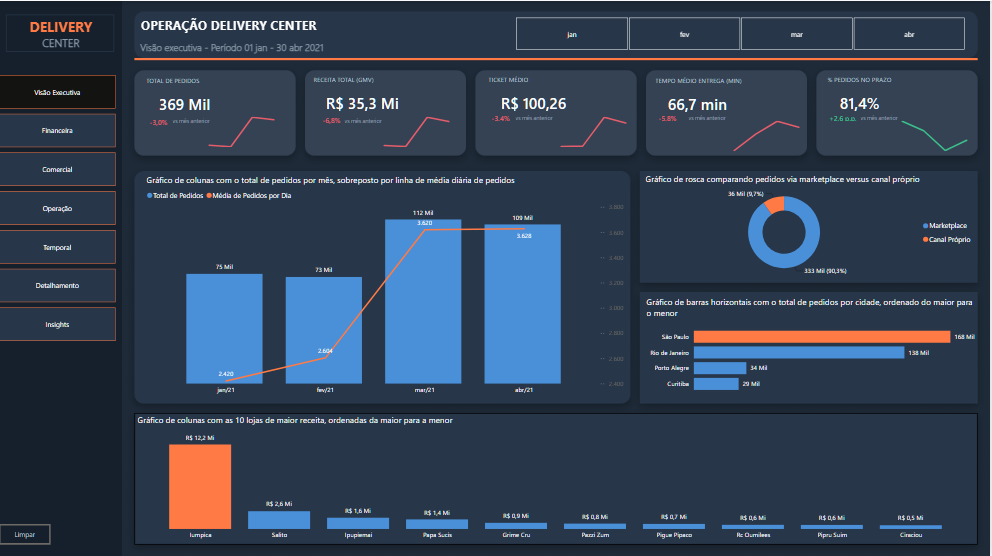
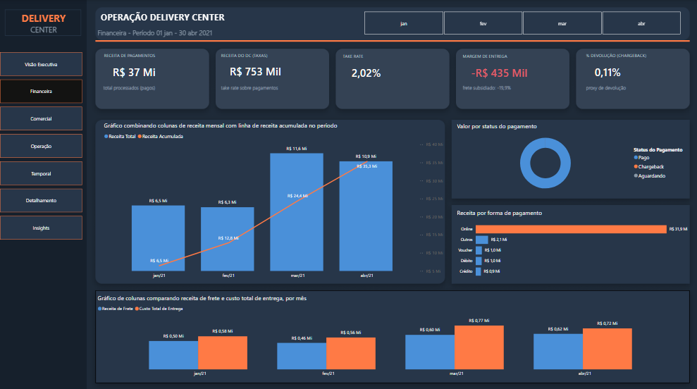
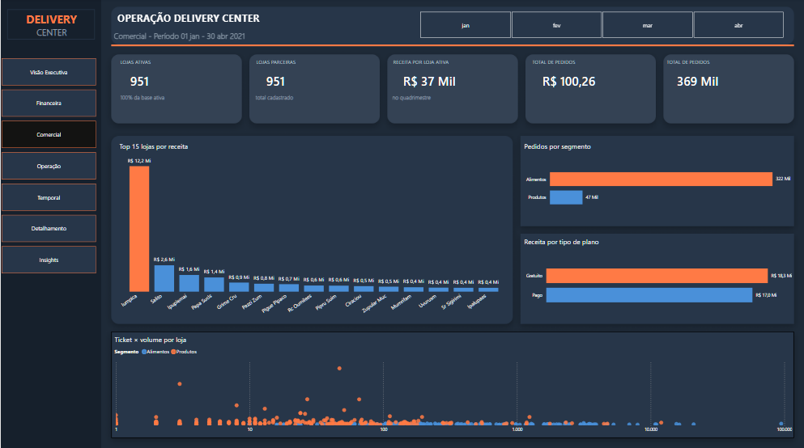
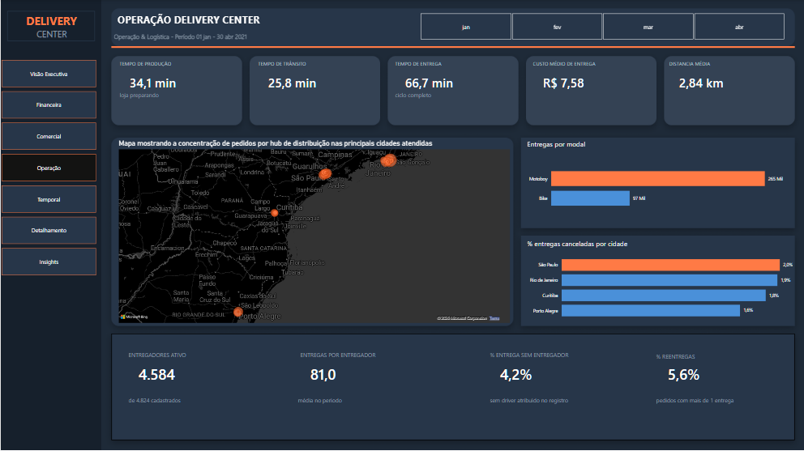
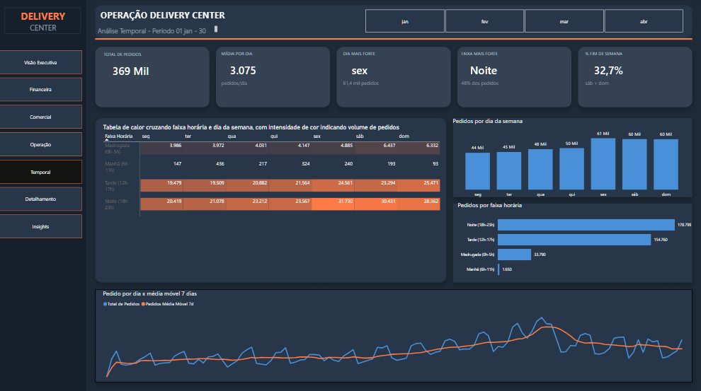
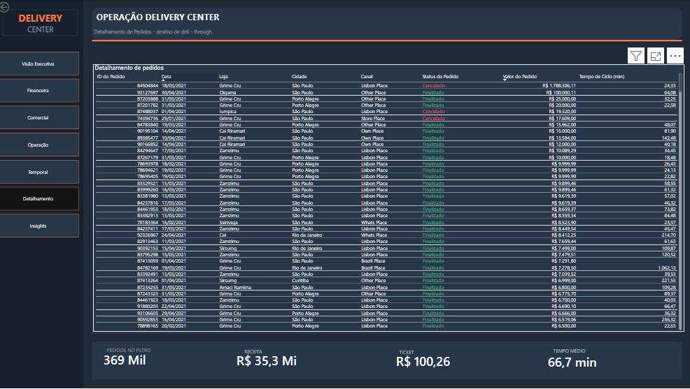
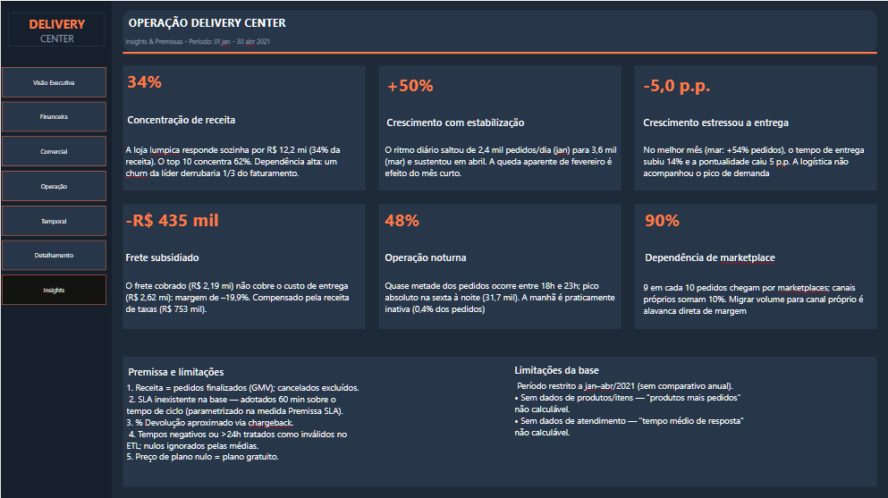
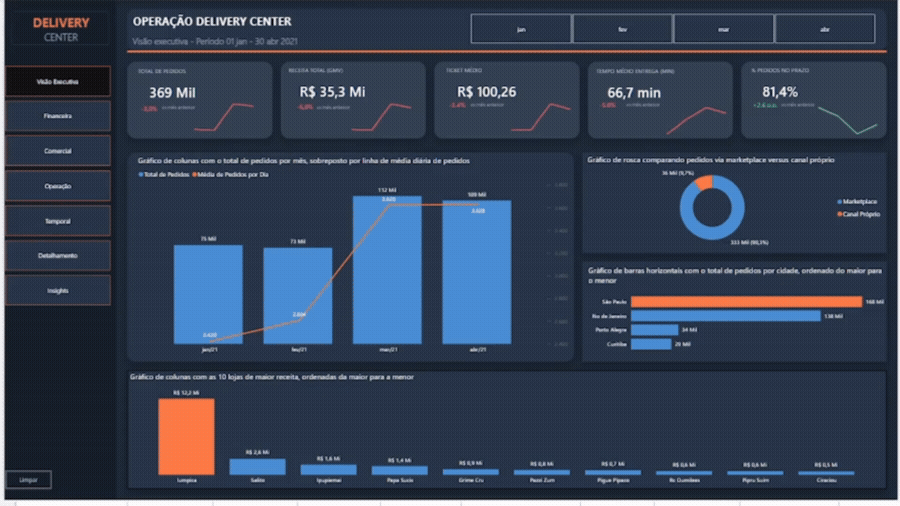

<div align="center">

<!--  -->

# 🚚 Delivery Pulse

### Business Intelligence para Operações de Delivery em Escala


**Autora:** Liliam Kezia Oliveira Souza

</div>

---

## 💎 Proposta de valor

> Um case de Business Intelligence completo — da modelagem de dados brutos à decisão executiva — que transforma **369 mil pedidos** de um Delivery Center em um sistema de decisão com **57 métricas de negócio**, star schema auditável e uma camada de insights que já aponta, com números, onde a operação está sangrando margem.

## 📄 Resumo executivo

Um Delivery Center processou quase 369 mil pedidos entre janeiro e abril de 2021, mas operava sem visibilidade estruturada sobre onde estava ganhando e onde estava perdendo dinheiro.

**Delivery Pulse** resolve isso com um pipeline completo: ETL parametrizado, modelo star schema com 8 relacionamentos auditados, 57 medidas DAX organizadas por domínio de negócio, e um relatório de 7 páginas que separa a leitura executiva da leitura operacional.

O resultado já revelou riscos reais de negócio:

| Achado | Número |
|---|---|
| 🎯 Concentração de receita em 1 única loja | **34%** |
| 💸 Margem negativa em frete (subsídio) | **-R$ 435 mil** |
| 🌙 Pedidos concentrados no período noturno (18h–23h) | **48%** |
| 🛒 Dependência de marketplaces terceiros | **90%** |

Detalhes completos da análise em [`docs/BUSINESS_CASE.md`](docs/BUSINESS_CASE.md).

---

## 📸 Preview

### Visão Executiva


### Financeira


### Comercial


### Operação


### Temporal


### Detalhamento (drill-through)


### Insights




---

## 🗂️ Sumário

- [Estrutura do relatório](#-estrutura-do-relatório)
- [Arquitetura técnica](#-arquitetura-técnica)
- [Estrutura do repositório](#-estrutura-do-repositório)
- [Como abrir o projeto](#-como-abrir-o-projeto)
- [Documentação](#-documentação)
- [Nota técnica: .pbix vs .pbip](#-nota-técnica-pbix-vs-pbip)

---

## 🧭 Estrutura do relatório

| Página | O que mostra |
|---|---|
| **Visão Executiva** | KPIs centrais e variação mês a mês, panorama consolidado |
| **Financeira** | Receita, take rate, margem de frete, chargebacks |
| **Comercial** | Desempenho por loja, segmento e tipo de plano |
| **Operação** | Logística, entregadores, mapa de hubs |
| **Temporal** | Sazonalidade, heatmap de demanda por hora × dia da semana |
| **Detalhamento** | Tabela drill-through por Loja, Cidade, Canal ou Mês |
| **Insights** | Achados de negócio e premissas de dados, em texto |

## 🏗️ Arquitetura técnica

- **Modelo:** star schema — 3 tabelas fato (`fPedidos`, `fPagamentos`, `fEntregas`) + 6 dimensões, 8 relacionamentos Many-to-One
- **DAX:** 57 medidas organizadas em 5 pastas temáticas (KPIs, Financeiro, Operacional, Inteligência de Tempo, Auxiliares)
- **ETL:** Power Query parametrizado, com tratamento de encoding, outliers e tipos de dados
- **Extras:** drill-through dedicado, 3 páginas de tooltip customizado, medida de documentação técnica embutida no próprio modelo

## 📁 Estrutura do repositório

```
delivery-pulse/
├── README.md
├── CHANGELOG.md
├── LICENSE
├── .gitignore
├── assets/
│   ├── screenshots/     ← imagens das páginas do relatório
│   ├── demo/             ← GIF de navegação
│   └── cover/            ← imagem de capa
├── docs/
│   ├── TECHNICAL_DOCUMENTATION.md   ← modelo, DAX, ETL completos
│   ├── DATA_DICTIONARY.md           ← dicionário de dados tabela a tabela
│   ├── BUSINESS_CASE.md             ← case de negócio detalhado
│   └── AUDIT_REPORT.md              ← auditoria técnica própria (UX, DAX, performance...)
├── src/
│   └── Delivery Pulse.pbix
└── data/
    └── README.md         ← estrutura de dados esperada para refresh
```

## 💻 Como abrir o projeto

1. Requer **Power BI Desktop** (Windows).
2. Baixe `src/Delivery Pulse.pbix`.
3. Ajuste o parâmetro `pCaminhoFonte` (**Transformar Dados → Editar Parâmetros**) para a pasta local com os CSVs de origem — ver [`data/README.md`](data/README.md) para a estrutura esperada.
4. Clique em **Atualizar**.

## 📚 Documentação

| Documento | Conteúdo |
|---|---|
| [`docs/BUSINESS_CASE.md`](docs/BUSINESS_CASE.md) | Case de negócio completo, achados quantificados, premissas assumidas |
| [`docs/TECHNICAL_DOCUMENTATION.md`](docs/TECHNICAL_DOCUMENTATION.md) | Todas as 57 medidas DAX, código Power Query, modelo de dados |
| [`docs/DATA_DICTIONARY.md`](docs/DATA_DICTIONARY.md) | Dicionário de dados — toda tabela e coluna do modelo |
| [`docs/AUDIT_REPORT.md`](docs/AUDIT_REPORT.md) | Auditoria técnica própria — UX, Power Query, modelagem, DAX, performance, storytelling |


---


<div align="center">

*Case de portfólio em Business Intelligence — Power BI, DAX, modelagem dimensional e Power Query.*

</div>
